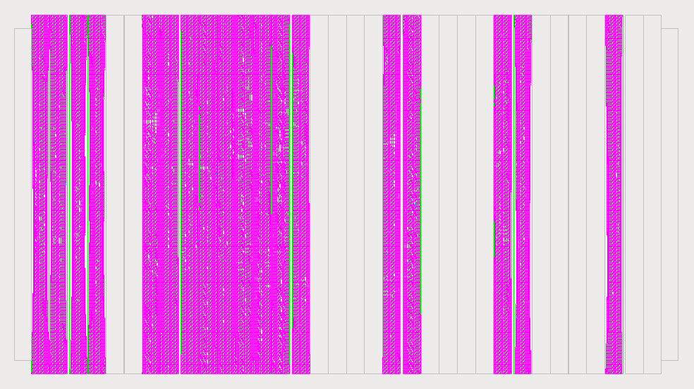

==================================================================
SNRS - SuperNEMO Realistic Sources modeling package
==================================================================

:author: F.Mauger
:date: 2021-05-30

	  

.. contents::

Introduction
============

This package  provides tools  to build  geometry models  for SuperNEMO
source foil  strips with  realistic shapes. It  uses the  raw datasets
from  the  Laser Tracker  3D  measurement  campaign  made at  the  end
of 2018.   Its objective  is to  elaborate a  best-fit model  for each
source strips which is significantly  deformed in the SuperNEMO source
frame  and  for  which  a  potential impact  on  the  quality  of  the
simulation and/or reconstruction datasets is expected.
   

Dependencies
============

SNRS depends  on Bayeux  3.5.0 and  the GSL  libray for
direct access to some numerical primitives.

   
Build and install SNRS
========================================

We assume here a ``bash`` shell.       

#. Setup Bayeux:

   .. code:: bash

      $ bayeux_3_5_0_setup # or any typical script to be run from your shell
      $ bxquery --version
      3.5.0
      $ bxquery --cmakedir
      /data/sw/BxSoftware/BxInstall/bayeux-3.5.0/lib/cmake/Bayeux-3.5.05
   ..
  
#. For developpers only: prepare the environment to manage primary and secondary datasets:

      You should  download and address  the primary raw  LTD datasets.
      The  ``SNLTD_3D_measurements-1.0.tar.gz``  archive is  available
      from  the private  directory ``/sps/nemo/snemo/snemo_data/misc``
      at CCIN2P3.

      .. code:: bash
	     
	 $ mkdir /var/SuperNEMO # or any suitable place with o(GB) available space
	 $ cd /var/SuperNEMO
	 $ # Download the tarball SNLTD_3D_measurements-1.1.tar.gz  which contains raw LTD datasets from CCIN2P3... 
	 $ tar xzf SNLTD_3D_measurements-1.1.tar.gz
	 $ export RAW_LTD_DATA_DIR="/var/SuperNEMO/SNLTD_3D_measurements"
      ..

#. Configure, build and install SNRS:

   Several configuration options are proposed but should  not be used
   for a production installation:

   - ``SNRS_DEVELOPER_BUILD`` (default:  ``OFF``) : this  build option
     is reserved  for the  developer(s) which  are responsible  of the
     reconstruction of the source strip mesh datasets, fitted from the
     raw LTD datasets.
   - ``SNRS_ENABLE_TESTING`` (default: ``OFF``) : build test programs.
   - ``SNRS_GENERATE_DATA`` (default: ``OFF``)  : generate fitted mesh
     datasets   at    build/installation   stage   (reserved   for
     developper(s)).
   - ``SNRS_WITH_DOC``    (default:   ``OFF``)    :   generate    some
     documentation files (reserved for developper(s)).
     
   
   .. code:: bash

      $ cd ${HOME}/SuperNEMO/sw/SNRS # or any suitable place with enough available storage
      $ git clone https://github.com/SuperNEMO-DBD/SNRS SNRS.git
      $ mkdir _build.d
      $ cd _build.d
      $ cmake \
         -DCMAKE_INSTALL_PREFIX=${HOME}/SuperNEMO/sw/SNRS/install-1.0.0 \
         -DBayeux_DIR=$(bxquery --cmakedir) \
         ${HOME}/SuperNEMO/sw/SNRS/SNRS.git
      $ make
      $ make install
   ..

#. Setup:

   .. code::

      $ export PATH=${HOME}/SuperNEMO/sw/SNRS/install-1.0.0/bin:${PATH}
      $ which snrs-config
      $ snrs-config --help
      ...
   ..
   
Documentation
========================================

Geometry modelling
-------------------

SNRS aims  to model the ITEP-style  source foil in SuperNEMO  using 3D
mesh  (tessellated solid)  in  order to  approximate  the real  curved
shapes of these  foils at a good level of  approximation, typically at
millimeter  scales and  at least  below the  resolution of  the vertex
reconstruction  precision.  The  package thus  provides some  tools to
describe each source  foil as a 3D mesh made  of hundreds of 3D-tiles,
each defined by triangular facets with the same effective surface and volumes.

In  the current  release  of  SNRS, each  ITEP-style  source strip  is
composed of 10 columns and 100  rows, so 1000 individual 3D hexahedron
tiles  which  are  basically  slightly  deformed  rectangular  cuboid.
Neglecting the streching effect in the Y and Z direction, each tile is
considered to be  13.55 mm width and 27 mm  height.  This model allows
to easily  implement vertex generators  with uniform sampling  both on
the surface and bulk of the tiles. Finally, each tile has 4 triangular
facets  :  2  on its  back  face  (Italy)  and  2 on  its  front  face
(France). The facets which encloses the 3D tile on the other sides are
not considered  by any algorithm  (but they are implemented  to ensure
the consistence  of the  structure of  the mesh).  Note also  that the
model  takes into  account the  Mylar films  which wraps  the selenium
foils. Both back and front films are thus associated to their own mesh
models which  are derived from the  main meshed model of  the selenium
strip.

SNRS provides  the ``snrs::mesh_pad_model`` geometry  model (inherited
from the  Bayeux's ``geomtools::i_boxed_model`` class). Given  a strip
ID, this class  automatically build the geometry layout  of the strip,
including the shape of the  enriched selenium foil, the wrapping Mylar
films and the  material. The parameters of each  ITEP-style source pad
is  hardcoded in  the ``sngeom::_init_foil_models_()``  method of  the
sngeom.cpp``  file:  position  of  the  strip  in  the  source  frame,
dimensions, name of the material (using  the naming scheme in the flat
realistic modelling of the sources in Falaise).

SNRS  provides  specific dataset  files  for  describing the  deformed
shapes of  the ITEP-style source  foils and associated  wrapping films
(see  the   ``resources/data/geometry/source_foils/fsf/``  directory).
For  convenience,  these datasets  have  been  pre-calculated so  that
end-users   just  have   to   install  and   use   them  through   the
``snrs::mesh_pad_model`` geometry model.

SNRS                 provides                 also                 the
``resources/config/snemo/demonstrator/geometry/GeometryModels/source_module/realistic/strips_itep_like.geom``
configuration  file  which  contains  the parameters  used  for  each
ITEP-style  source strip.  This  file  will be  used  by Falaise  to
integrate a new variant of the geometry layout of the source foils.

Vertex generation
--------------------

SNRS provides  the ``snrs::mesh_pad_vg`` vertex generator class (inherited
from the  Bayeux's ``geomtools::i_from_model_vg`` class). The set of configuration
parameters of such a generator object describe:

* the *origin* (strip/pad identifier in the source frame)
* the *mode* (surface or bulk)
* some  specific selection  informations (side,  set of  tiles in  the
  mesh)  to  restrict  the  region  of  the  source  foil  for  vertex
  generation.

Both vertex generation  modes (*surface* and *bulk*)  are based on
an approximated  scheme justified by  the very small thickness  of the
source foil compared to its other dimensions. With this geometry model
of the curved source fiols, each triangular facet of a given mesh tile
(selenium or Mylar) has  a width of 13.55 mm and height  of 27 mm. The
thickness of the selenium foil is about 200-300 um and Mylar films are
12  um thick.  The vertex  generation  algorithm thus  uses a  uniform
generation sampler  on a reference triangular  surface (available from
the Bayeux's genvtx module) then skips  the vertex along the normal of
the facet  by th proper distance,  depending on the mode:

- for *surface* generators, this implies  a shift by a few micrometers
  on top of the surface of the considered tile/facet.
- for *bulk*  generators, the shift  is
  uniformly randomized to reflect the thickness of the selenium foil.

Considering the resolution  of the vertex reconstruction  and the fact
that the  mesh model itself  is already  an approximation of  the real
source geometry, no serious bias is expected from this approximation.

Typical vertex generator configurations are:

* Surface vertex generator:
  
  ::

     origin         : string = " category='source_pad' module={0} strip={34} pad={0} "
     mode           : string = "surface"    # For modelling the deposit of contaminants on the surface of the strip
     back_side      : boolean = false       # Only from the 
     front_side     : boolean = true        # front side of the source (France)
     skin_thickness : real as length = 1 um # Effective thickness of the vertex generation layer
     skin_skip      : real as length = 1 um # Tiny shift (normal to the surface) of the vertex
                                            # with respect to the source tiles
  ..

* Bulk vertex generator:
  
  
  ::

     origin         : string = " category='source_pad' module={0} strip={34} pad={0} "
     mode           : string = "bulk"  # For modelling the bulk contamination of the selenium
     skin_thickness : real as length = 1 um # Thickness of the excluded region from the surface 
  ..

 
* Selection of a specific set of tiles by range:

  ::

     tiles.min_column : integer = 2      # Only tiles from column 2
     tiles.max_column : integer = 3      #   to column 3 (included, from a total of 10 columns with 13.55 mm width)
     tiles.min_row    : integer = 25     # Only tiles from row 25
     tiles.max_row    : integer = 27     #   to row 27 (included, from a total of 100 rows with 27 mm height)
     tiles.part_0     : boolean = true   # Use only the lower triangular part of the tiles (facet)
     tiles.part_1     : boolean = false  # Do no use the upper triangular part of the tiles (facet)
  ..
 
  
* Selection of  a specific  set of  tiles from  the source  mesh using
  regexes (can  be used to  describe a hot  spot, for bulk  of surface
  modes):

  ::

    tiles.patterns : string[29] = \
      "[*,3,76,1]" \  # Both sides of the tile column=3, row=76, upper part
      "[*,4,76,*]" \  # Both sides of the tile column=4, row=76, both parts
      "[1,*,77,0]"    # French side of all tile's columns at row=77 for lower part
  ..

    
  
Building Laser Tracker Data (LTD) datasets (developers only)
------------------------------------------------------------

Directory : ``doc/build-ltd``

Building Foil Shaping Fit (FSF) datasets (developers only)
-----------------------------------------------------------------
Directory : ``doc/build-fsf``

Developers' corner
=======================

Useful environment variables for development stuff:

.. code:: bash

   $ bayeux_3_5_0_setup # Or any command that setups Bayeux
   $ cd /path/to/SNRS/source/directory
   $ export RAW_LTD_DATA_DIR="/path/to/SNLTD_3D_measurements"
   $ bash build.bash
   $ cd _build.d
   $ export SNRS_BUILD_DIR=$(pwd)
   $ export SNRS_TESTING_DIR=$(pwd)/../snrs/test
   $ export SNRS_RESOURCE_PATH=$(pwd)/../resources
   $ export PATH=$(pwd)/../_install.d/bin:${PATH}
   $ make
   $ make test
   $ make install
   $ cd ../_install.d
   $ tree
..
 
.. end
   
