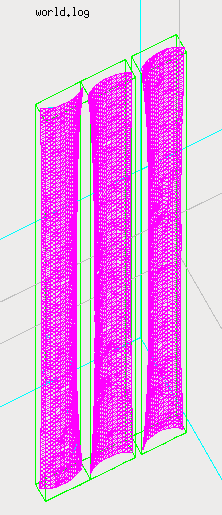

==================================================================
SNRS - SuperNEMO Realistic Sources modeling package
==================================================================

:author: F.Mauger
:date: 2021-04-11

	  

.. contents::

Introduction
============

This package  provides tools  to build  geometry models  for SuperNEMO
source foil  strips with  realistic shapes. It  uses the  raw datasets
from  the  Laser Tracker  3D  measurement  campaign  made at  the  end
of 2018.   Its objective  is to  elaborate a  best-fit model  for each
source strips which is significantly  deformed in the SuperNEMO source
frame  and  for  which  a  potential impact  on  the  quality  of  the
simulation and/or reconstruction datasets is expected.

This is a very preliminary and exploratory work, still in an intensive
development phase... It is expected that  some changes will occur in a
near future before to provide a *production* package.
   

Dependencies
============

SNRS depends  on Bayeux  3.5.0 (coming  soon) and  the GSL  libray for
direct access to some numerical primitives.

   

Preliminary informations for developpers
========================================

We assume here a ``bash`` shell.       

#. Setup Bayeux:

   .. code:: bash

      $ bayeux_3_5_0_setup # or any typical script to be run from your shell
      $ bxquery --version
      3.5.0
      $ bxquery --cmakedir
      /data/sw/BxSoftware/BxInstall/bayeux-3.5.0/lib/cmake/Bayeux-3.5.05
   ..
  
#. For developpers only: prepare the environment to manage primary and secondary datasets:

      You should  download and address  the primary raw  LTD datasets.
      The  ``SNLTD_3D_measurements-1.0.tar.gz``  archive is  available
      from  the private  directory ``/sps/nemo/snemo/snemo_data/misc``
      at CCIN2P3.

      .. code:: bash
	     
	 $ mkdir /var/SuperNEMO # or any suitable place with o(GB) available space
	 $ cd /var/SuperNEMO
	 $ # wget https://somewhere-on-the-web/supernemo-repository/SNLTD_3D_measurements-1.0.tar.gz . 
	 $ tar xzf SNLTD_3D_measurements-1.0.tar.gz
	 $ export RAW_LTD_DATA_DIR="/var/SuperNEMO/SNLTD_3D_measurements"
      ..

#. Configure, build and install SNRS:

   Several configuration options  are proposed but should  not be used
   for a production installation:

   - ``SNRS_DEVELOPER_BUILD`` (default:  ``OFF``) : this  build option
     is reserved  for the  developer(s) which  are responsible  of the
     reconstruction of the source strip mesh datasets, fitted from the
     raw LTD datasets.
   - ``SNRS_ENABLE_TESTING`` (default: ``OFF``) : build test programs.
   - ``SNRS_GENERATE_DATA`` (default: ``OFF``)  : generate fitted mesh
     datasets   at    build/installation   stage   (    reserved   for
     developper(s)).
   - ``SNRS_WITH_DOC``    (default:   ``OFF``)    :   generate    some
     documentation files (reserved for developper(s)).
     
   
   .. code:: bash

      $ cd ${HOME}/SuperNEMO/sw/SNRS # or any suitable place with enough available storage
      $ git clone https://github.com/SuperNEMO-DBD/SNRS SNRS.git
      $ mkdir _build.d
      $ cd _build.d
      $ cmake \
         -DCMAKE_INSTALL_PREFIX=${HOME}/SuperNEMO/sw/SNRS/install-1.0.0 \
         -DBayeux_DIR=$(bxquery --cmakedir) \
         ${HOME}/SuperNEMO/sw/SNRS/SNRS.git
      $ make
      $ make install
   ..

#. Setup:

   .. code::

      $ export PATH=${HOME}/SuperNEMO/sw/SNRS/install-1.0.0/bin:${PATH}
      $ which snrs-config
      $ snrs-config --help
      ...
   ..
   
Documentation
========================================

Building Laser Tracker Data(LTD) datasets
-----------------------------------------

Directory : ``doc/build-ltd``

Building Foil Shaping Fit (FSF) datasets
----------------------------------------
Directory : ``doc/build-fsf``

Developers' corner
=======================

Useful environment variables for development stuff:

.. code:: bash

   $ bayeux_3_5_0_setup # Or any command that setups Bayeux
   $ cd /path/to/SNRS/source/directory
   $ export RAW_LTD_DATA_DIR="/path/to/SNLTD_3D_measurements"
   $ bash build.bash
   $ cd _build.d
   $ export SNRS_BUILD_DIR=$(pwd)
   $ export SNRS_TESTING_DIR=$(pwd)/../snrs/test
   $ export SNRS_RESOURCE_PATH=$(pwd)/../resources
   $ export PATH=$(pwd)/../_install.d/bin:${PATH}
   $ make
   $ make test
   $ make install
   $ cd ../_install.d
   $ tree
..
 
.. end
   
