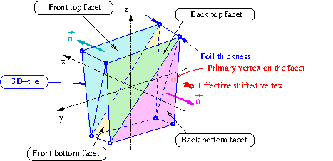

=========================================
Documentation on the SNRS geometry model
=========================================

:author: F.Mauger
:date: 2021-09-20
       

Layout of the deformed source foil 3D-tiles
===========================================

A 3D-tiles as a basic element of a deformed ITEP-like source foil:
frame and orientation conventions, facets naming.

